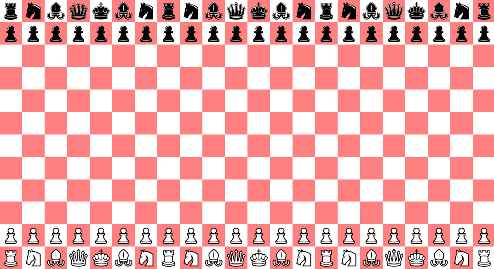
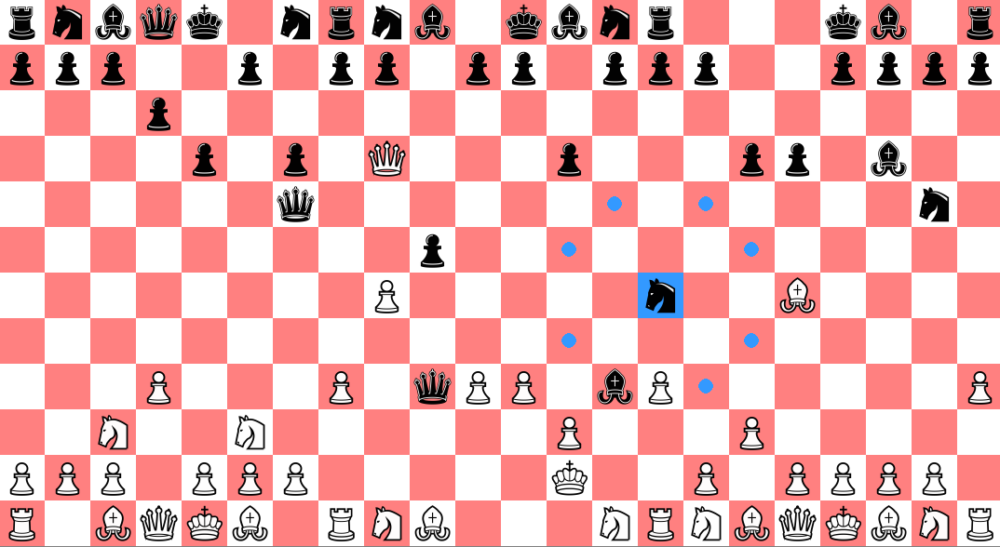

# Battlefield Chess
Are you tired of getting punished for hanging your pieces? Do you wish you could ignore checks on your king?
Then Battlefield Chess is for you, where there is so much chaos on the board that you may as well play with a blindfold.
## Built with
Python & pygame library.

## Rules
The board is 22 by 12 and each side has 113 points of value (as opposed to 8 x 8 and 39 points of value). 
There are three kings on each side and two must be captured before the last is checkmated to win the game. 
As long as there are at least two kings remaining, they do not have to respond to checks and may be sacrificed.
Pawns can move up two squares twice as their first two moves instead of the standard once.